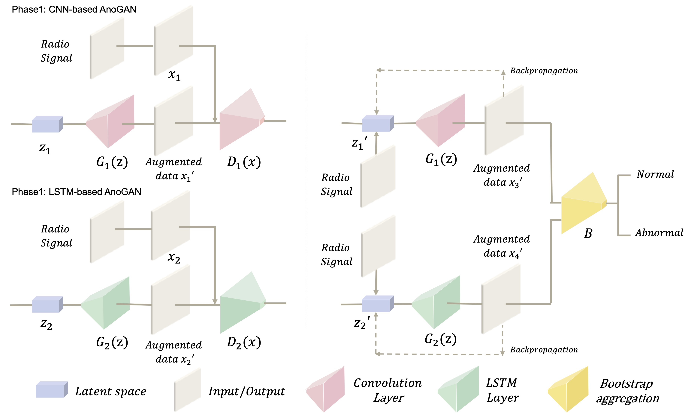

# Detecting wireless signal noise in mobile radio communications using spatio-temporal AnoGAN

#### This model ensemble a set of CNN-based and LSTM- based AnoGAN in parallel to simultaneously learn the time- series features of the radio modulation signal and the shape expressed in the complex planes.
#### To design the spatio-temporal AnoGAN, we referred to two papers written by [T. Schlegl et al.](https://arxiv.org/abs/1703.05921) and [M.A. Bashar et al.](https://arxiv.org/abs/2008.09567)
#### In addition, it was implemented based on the code uploaded to github by [yjucho1](https://github.com/yjucho1/anoGAN) and [mdabachar](https://github.com/mdabashar/TAnoGAN).

## Spatio-temporal AnoGAN Architecture
#### The spatio-temporal AnoGAN learns a radio-modulated signal in a complex plane image and time-series dataset in parallel. 
#### In phase 1, CNN-based AnoGAN examines images appearing in complex planes.
#### In phase 2, LSTM-based AnoGAN takes irregular trend information in radio signals.



## Dataset 
#### For the experiment, we use the open radio signal dataset, RadioML2016.10a (https://www.deepsig.ai/datasets). 
#### It is created using the GNU Radio toolkit.

## Usage  
First, check directory structure

```bash
├── dataset
│   └── sample.npy
│
├── models
│   ├── __init__.py
│   ├── anogan.py
│   └── recurrent_models_pyramid.py
│
├── weights
│   ├── discriminator.h5
│   └── generator.h5
│
└── spatio_temporal_AnoGAN.ipynb
``` 

## Prerequisites (My environments)
- Python 3.7, Tensorflow 2.9, Keras, Numpy, Pandas, Matplotlib, OpenCV
- A recent NVIDIA GPU

## Reference
#### 1. https://github.com/mdabashar/TAnoGAN
#### 2. https://github.com/yjucho1/anoGAN
